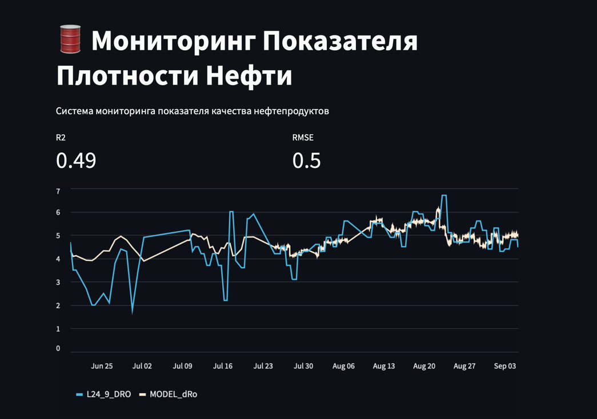

# Проектный практикум

> Авторы:
>
> - Чумаков Михаил Дмитриевич
> - Чумакова Анастасия Ильинична

## Описание проекта

Проект представляет собой минимально жизнеспособный продукт (MVP) для системы мониторинга качества нефтепродуктов.
Это позволяет нам собирать, анализировать и визуализировать данные о качестве нефтепродуктов почти в реальном времени.

Система разработана с использованием различных технологий, включая Python, Streamlit и js
для создания интерактивного веб-интерфейса, и PostgreSQL для управления базой данных.
Система также будет интегрирована с API компании "Газпром" при помощи ETL сервисов и сервисов шлюзов,
для получения и обновления данных о качестве нефтепродуктов.

Основная цель проекта - предоставить компании "Газпром" инструмент,
который поможет им быстро и эффективно анализировать качество своих нефтепродуктов,
выявлять проблемы и недостатки в процессе производства и доставки,
а также принимать своевременные решения для улучшения качества и эффективности работы.

Система предлагает различные функции для мониторинга и анализа данных,
включая дашборды для визуализации данных.
В будущем планируется добавить систему уведомлений о возможных проблемах и модуль для генерации отчетов.
Кроме того, система предоставляет возможность настройки параметров мониторинга в соответствии с потребностями компании.

Проект находится в стадии активной разработки, и мы надеемся на вашу поддержку и обратную связь для его улучшения.

## Развертка базы данных

```bash
docker run -d --name timescaledb -p 5432:5432 -e POSTGRES_PASSWORD=password timescale/timescaledb-ha:pg14-latest
```

## Установка зависимостей

```bash
poetry install
```

## Запуск приложения

```bash
poetry run python -m streamlit run src/app.py  
```

## Модели данных

Таблица для хранения временных рядов:

`time_series`

| Колонка | Тип данных                        | Описание                  |
| -------------- |-----------------------------------|---------------------------|
| time           | timestamp with time zone not null | Временная метка измерения |
| tag            | varchar(255) not null             | Имя тега временного ряда  |
| value          | double precision not null         | Значение измерения        |


Таблица для хранения конфигураций моделей:
`model_configs`

| Колонка | Тип данных                              | Описание            |
| -------------- |-----------------------------------------|---------------------|
| model_name     | model_name varchar(256) not null unique | Имя модели          |
| config         | jsonb                 | Конфигурация модели |


Генерация таблиц (не использую алембик, так как MVP):

```sql
begin;
create table time_series
(
    time  timestamp with time zone not null,
    tag   varchar(255)             not null,
    value double precision         not null
);

select create_hypertable('time_series', 'time');

create table model_configs
(
    model_name varchar(256) not null unique,
    config jsonb
);
commit;
```

## Структура проекта

```bash
.
├── README.md - Описание проекта
├── poetry.lock - Обеспечивает согласованность зависимостей проекта.
├── pyproject.toml - Содежит метаданные о проекте.
└── src
    ├── app.py - Точка входа в приложение (весь UI тут)
    ├── config.py - Модуль конфигурации приложения
    ├── db.py - Модуль с соединениями БД
    ├── extractor.py - Модуль извелечения данных из источников
    ├── repo.py - Репозитории источников данных
    ├── schemas.py - Схемы описывающие данные
    └── train.py - Модуль обучения моеделй и прогноза
```

## Скриншот работающего проекта:
